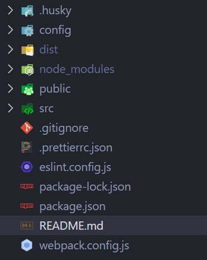
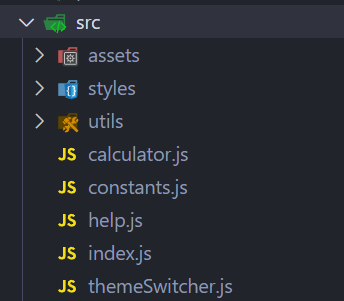

# Simple Calculator

## Task

https://docs.google.com/document/d/1zpXXeSae-BlcxPKgw3DhxZA92cspVailrPYoaXSYrW8/edit#heading=h.5dt3hghpa22f

## How to run the app

To run the app use `npm run start`. This will start a development server on your local machine.

## Folder structure

- **husky**: contains pre-commit file
- **config**: contains configuration for webpack
- **dist**: contains a builded application
- **public**: contains public files
- **src**: contains source files

### src folder

- **assets**: contains fonts used in the application
- **styles**: contains .css files with styles
- **utils**: contains .js files with utility functions
